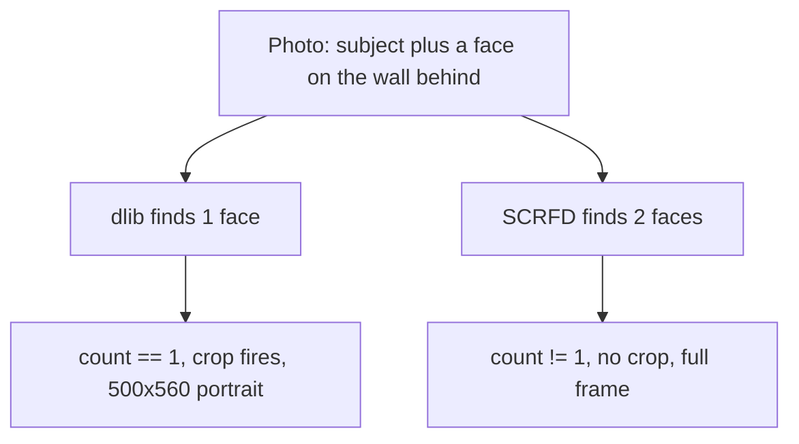

We run a service that removes the background from a user's photograph and, if it looks like a portrait of one person, crops it to a standard frame. The "looks like one person" test was a face count from **dlib**: exactly one face, crop it.

We wanted to move to **SCRFD** — newer, more accurate, better on the hard cases. The diff is essentially one line. Swap the detector, keep everything else.

I nearly shipped it after looking at a dozen images. Instead I built a comparison against 200 real production photographs. The result was not what I expected and it changed what we shipped.

## The setup

Three decisions that turned out to matter more than the metric I chose.

**Use real production outputs, not reproductions.** I pulled the actual stored output the old pipeline had produced for each image, rather than re-running the old code. These sound equivalent and are not: re-running tells you what the old code *would* do today, on today's dependencies, with today's config. The stored artefact tells you what users actually got.

**Composite transparency on a grey checkerboard.** This is the decision I'd most want to pass on. Many subjects wear white shirts. Render a cutout with a transparent background onto a white page and you cannot tell a white shirt from a hole where the background used to be. An entire class of segmentation error becomes literally invisible. The checkerboard makes it obvious.

**Write out every per-image number.** Mask IoU, dimensions, crop decision, face count, latency — to CSV and JSON. Not just the summary, because the summary is derived and I didn't yet know which slice would matter.

## The numbers

| Metric | Value |
|---|---|
| Images compared | 200 |
| Same crop decision | 184 / 200 (92%) |
| **Crop decision flipped** | **16 / 200 (8%)** |
| Subject-mask IoU, median | 0.9952 |
| IoU p10 / min | 0.856 / 0.618 |
| Essentially identical (IoU > 0.99) | 95 / 184 |
| Latency p50 / p90 | 384ms / 885ms |

Read the top of that table and it's an easy ship. Median IoU of 0.9952. Ninety-five images pixel-identical. On the 184 where both versions cropped, the framing difference is negligible — SCRFD's boxes sit slightly higher, including a hairline that dlib's square box clipped, so its crops run a few percent tighter. Strictly better, arguably.

The 8% is the entire story.

## Why more accurate meant worse

SCRFD finds faces dlib misses. That is the reason we wanted it.

On a photo with a second, partially-visible face — a bystander at the edge of frame, a person in a photograph hanging on the wall behind the subject — dlib finds one face and SCRFD finds two.

`face_count == 1` is now false. The crop gate doesn't fire. The image comes back **full-frame instead of cropped**.

The user uploads a portrait and gets an uncropped snapshot on their poster. That is a much larger visual change than any shift in a crop box — and it is caused *directly by the detector being better at its job*.

The model improved. The product regressed. The gate was the bug, and it had been a bug the whole time — it just happened to be a bug that dlib's blind spot concealed.

## The part that scares me

**I would not have found this by looking at images.**

Sixteen out of two hundred. Pick a dozen at random and you have a roughly 40% chance of seeing zero of them. Look at those twelve, note that the cutouts are clean and the crops are tight, and merge with genuine confidence.

One in twelve users gets a broken poster, and you learn about it from support tickets weeks later, by which point the detector swap is several deploys back and nobody's first hypothesis.

The spot check wasn't just insufficient. It was *actively misleading*, because the thing it does sample — cutout quality and framing — genuinely did improve.

## What I'd generalise

**Aggregate metrics can measure the wrong thing beautifully.** Median IoU 0.9952 is an excellent number, correctly computed, and irrelevant to the actual regression. IoU compares two masks. It has nothing to say about a categorical decision that determines whether you produce a mask at all. If a metric cannot express your failure mode, its value tells you nothing about your failure mode.

**A model swap invalidates every threshold tuned against the old model.** The one-line diff had a blast radius covering all downstream logic that depended on the old model's behavioural quirks. Any constant fitted to a model's output is coupled to that model, whether or not anyone wrote that down.

**Measure the decision, not just the output.** Tracking crop decision alongside IoU is what surfaced this. It cost one extra column. Had I only tracked mask agreement — the obvious thing to track — the report would have said "ship it" in confident numbers.

**Choose a visualisation that makes errors ugly.** The checkerboard was worth as much as anything in the table. Evaluation design is design: if your presentation flatters the output, you have built a tool for reassurance rather than for finding out.

## The fix

Not the detector. The gate.

Counting faces and demanding exactly one was always a proxy for "is this a portrait of one person," and it only worked because dlib under-counted in a way that suited us. The correct formulation is about the *dominant* subject — largest face, sufficiently central, sufficiently large relative to the frame — which is a question a better detector answers better rather than worse.

That's the satisfying part. Once the regression was understood, the more accurate model became straightforwardly an upgrade. We just had to stop depending on the old one being wrong.
