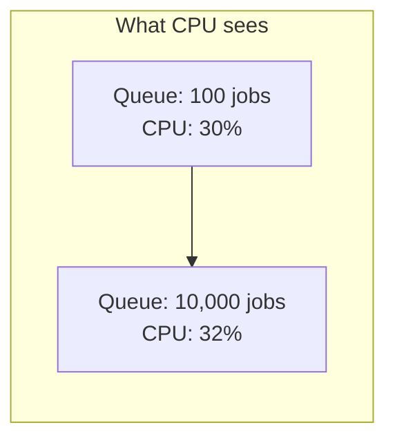

If your service answers HTTP requests, CPU utilisation is a decent proxy for load. More requests, more CPU, scale up. The default HorizontalPodAutoscaler does the right thing and you can stop reading.

If your service pulls jobs off a queue, CPU utilisation is close to useless as a scaling signal, and the default will let you build a backlog you don't find out about for hours.

I learned this on a media generation pipeline — workers that composite images and render video — and the mechanism is general.

## Why CPU lies about queue depth

A worker processing a job spends most of its wall-clock time not computing. It is waiting on an object-storage read, on an FFmpeg subprocess, on a database round trip, on an HTTP call to another service.

So consider a pod with 20 in-flight jobs, all blocked on IO. CPU utilisation: low. Actual state: saturated, because the concurrency limit is reached and job 21 waits.

Now put 10,000 jobs in the queue. CPU on the existing pods doesn't move — they were already at their concurrency limit, and they were already mostly idle at the CPU level. **The autoscaler sees no change, because from CPU's point of view nothing changed.**



You scale up eventually, when latency degradation causes retries which cause real CPU, which is well after the point you needed to act. Then you scale down while the queue is still draining, because CPU drops as soon as the *rate* of new work slows — even with an enormous backlog remaining.

The autoscaler is measuring the wrong quantity. No amount of threshold tuning fixes a signal that isn't correlated with the thing you care about.

## Scale on the backlog

The thing you care about is how much work is waiting. On a Redis-backed queue, that is a `LLEN`.

KEDA does this directly:

```yaml
triggers:
  - type: redis
    metadata:
      address: redis.internal:6379
      listName: media:generation:pending
      listLength: '20'   # target items per replica
```

`listLength: 20` means: aim for 20 pending items per replica. 200 items in the queue asks for 10 replicas. The relationship between the signal and the desired capacity is direct and explainable, which is the property CPU never had here.

Scale-up now *leads* demand. The queue grows, replicas follow immediately, and the backlog drains rather than accumulating while an averaged CPU metric catches up.

## The failure that cost us hours

The lesson I'd most want to pass on, because it cost real money and nothing looked wrong.

We deployed a KEDA scaler whose `listName` didn't match the key the producer was actually writing to. Close, but not identical — an environment prefix difference.

Consider the failure mode. KEDA queries a key that doesn't exist. Redis returns 0. Zero pending items is a perfectly valid state, so KEDA scales the deployment to its minimum replicas and holds there. No error. No event. No alert. The scaler is working correctly, reading an empty queue, that happens to be the wrong queue.

Meanwhile the real queue grows without bound. The deployment sits at 2 replicas. Everything is green.

We found it when users complained. By then the backlog was hours deep.

Three things came out of that:

**Verify the key on both sides, in the target environment.** Not in the chart, not in the values file — in the running system. `LLEN` the key the scaler is configured with and confirm it's non-zero when work exists. This is now the first thing I check on any queue-based scaler.

**Alert on queue depth independently of the autoscaler.** The autoscaler is a control loop and it cannot be its own monitor. A Prometheus alert on queue length crossing a threshold would have caught this in minutes, and it doesn't share a failure mode with the scaler.

**Be suspicious of a deployment pinned at its minimum.** A queue-driven service that never scales isn't necessarily well-sized. It might not be receiving a signal at all. "Steady at minimum replicas" and "the scaler is broken" look identical on a graph.

## Things that took tuning

Once the signal is right, the rest is genuinely just tuning. What I'd know in advance next time:

**Concurrency and replica count are one decision.** Both raise throughput, and they compete for memory. Raising in-process concurrency while also raising replicas gave us plenty of throughput and constant OOM kills. Fix the per-worker concurrency against a memory budget first, then let replicas be the only scaling variable.

**Minimum replicas are a latency decision, not a cost decision.** Scaling from zero is free until someone is waiting. Interactive paths keep a warm floor; batch paths scale to zero and pay the cold start, because nothing is watching.

**Scale-down wants to be slower than scale-up.** The costs are asymmetric. Scaling up too eagerly wastes some money for a few minutes. Scaling down too eagerly kills a pod mid-job — and if that job isn't crash-safe, you've turned a capacity decision into data loss. Generous stabilisation on the way down, and make sure your jobs survive a pod dying, because eventually one will.

**Cost is a good detector of scaler bugs.** Per-namespace cost attribution caught a scaler stuck at maximum replicas well before anything else did. A service whose cost jumps without a traffic change is telling you something specific.

## The general point

The tuning is the easy part. Getting the signal right is the whole problem.

Before adjusting a threshold, it's worth asking plainly: **is this metric actually correlated with the thing I want more capacity for?** For request-serving services, CPU usually is. For anything that drains a queue, waits on IO, or holds long-lived connections, it usually isn't — and no threshold makes an uncorrelated signal useful.
