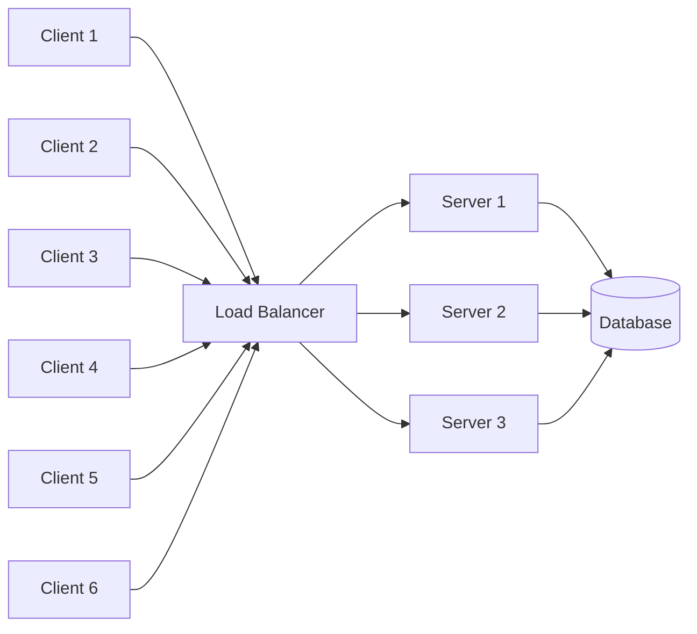
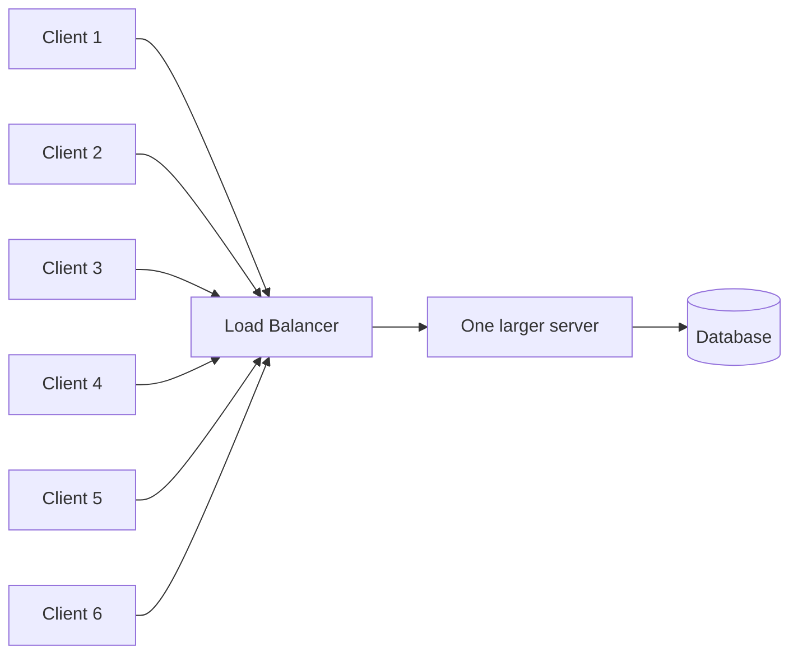

Every introduction to scalability gives you the same three bullets: load balance, scale horizontally, scale vertically. They're correct and they stop just before the interesting part.

Start with the shape everyone draws. Six clients, a load balancer, three application servers, one database:

**Horizontal scaling** is adding a fourth server. **Vertical scaling** is making one server bigger:

Both diagrams have the same problem, and it's in the bottom right corner.

## Scaling the tier that was never the constraint

Look at where the arrows converge. Three application servers, one database. Add a fourth server and you have four processes competing for the same connection pool, the same lock contention, the same disk.

If the application tier was your bottleneck, horizontal scaling solved it. If the database was — and past a certain point it always is — you have made the problem *worse*, because you've added another client to the contended resource.

This is the thing the three bullets omit: **scaling is not making a system faster. It is moving the constraint.** The work is knowing which tier holds the constraint right now, and where it goes next.

A rough order of what usually becomes the constraint, and what actually helps:

| Constraint | What helps | What doesn't |
|---|---|---|
| App CPU / memory | more app servers | a bigger database |
| Database reads | caching, read replicas | more app servers |
| Database writes | sharding, batching, queueing | read replicas |
| Connection pool exhaustion | pool sizing, pgbouncer-style pooling | more app servers |
| Slow synchronous work | move it to a queue | anything else |

That last row is the one I've reached for most often in practice. A meaningful share of "the API is slow" turns out to be work that had no business being in the request at all — sending an email, generating an image, updating a search index. Moving it to a background queue doesn't make the work faster; it takes it off the path where someone is waiting.

## Stateless is the property that makes scaling work

The load balancer diagram contains an unstated assumption: any server can serve any request. That's what lets the balancer distribute freely and what lets you add a fourth server without ceremony.

The moment a server holds state a request depends on — a session in local memory, an uploaded file on local disk, a cache the other servers can't see — that assumption breaks. Now requests must return to the server that has the state, which means sticky sessions, which means your load balancing is no longer balanced, and losing one server loses its users' state.

The fix is to push state out to something shared: sessions in Redis, files in object storage, cache in a cache server. Then "add a server" stays a trivial operation, which is the entire point of the exercise.

This is also the difference between the two scaling directions that nobody mentions. Vertical scaling works on stateful systems — you can give your database more RAM. Horizontal scaling mostly doesn't, which is why databases are hard to scale out and application servers are easy.

## Vertical scaling is underrated

Horizontal scaling gets the attention because it's the one that sounds like architecture. But vertical scaling has real advantages worth stating plainly:

- **No distribution problems.** No consensus, no partition tolerance, no cache coherence between nodes.
- **It's usually one config change.** An instance class in Terraform.
- **Modern instances are enormous.** A great many systems that "need to scale horizontally" fit comfortably on one large machine.

Its limits are equally plain: a ceiling on the largest available instance, cost that grows faster than linearly at the top end, and a single point of failure. That last one is usually the deciding factor — one big server is one thing to lose.

In practice I've found the useful sequence is: scale vertically until it's uncomfortable, because it's nearly free in engineering time; move state out so horizontal becomes possible; then scale horizontally for availability as much as for capacity.

## The question worth asking first

Before either kind of scaling: **what is the constraint, and how do I know?**

Not a guess. A measurement — a slow-query log, a saturated connection pool, a trace showing where time actually goes. Every time I've scaled something on intuition I've scaled the wrong tier, spent money, and moved the graph very slightly.
