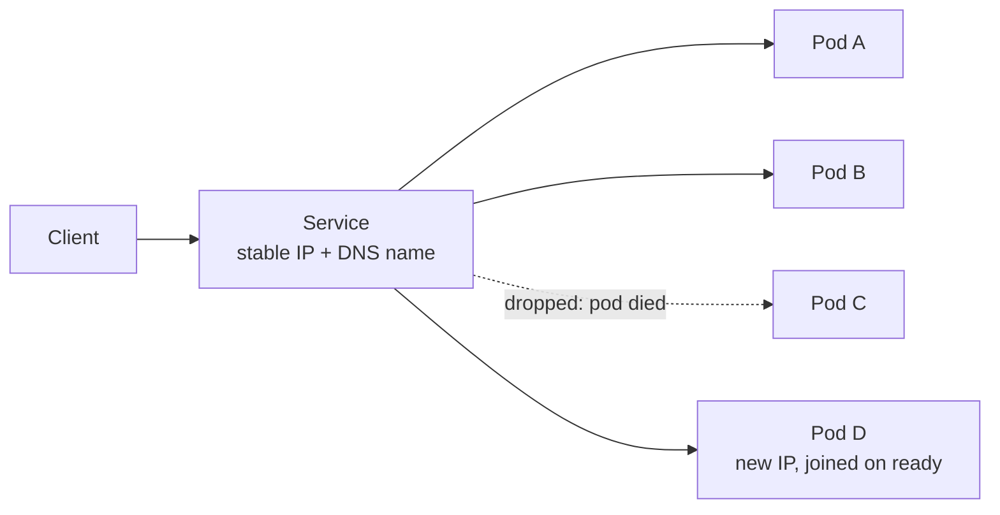
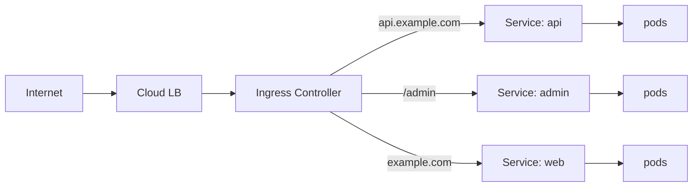

Say you have a pod running a web server and you want to reach it. The obvious move is to look up the pod's IP and talk to that. It works, right up until it doesn't.

Pods are ephemeral. They get rescheduled onto other nodes, replaced during a deploy, restarted after a liveness probe fails, evicted when the node is drained. Every one of those gives you a new pod with a new IP. Anything holding the old address is now talking to nothing.

So you need a stable endpoint that routes to whichever pods currently exist. That's a Service.

## What a Service actually gives you

Three things, and it's worth separating them because people usually mean only one:

- **Load balancing** across the pods behind it, rather than picking one and hoping.
- **Service discovery** — a name that resolves, so callers don't need to know about pods at all.
- **Exposure**, optionally, to things outside the cluster.

The Service doesn't track pods by IP. It tracks them by **label selector**. The Service says "everything labelled `app: my-api`", and the control plane keeps a list of matching, ready pod IPs — the Endpoints (or EndpointSlices) object. When a pod dies, it drops out of that list. When a new one passes its readiness probe, it joins.

This is the whole trick. The indirection is a label query, evaluated continuously, and it's why the Service survives a full pod turnover without anyone reconnecting.

## Readiness probes are part of the routing

This is the bit that bites people, so it's worth saying plainly: **a pod only receives Service traffic once it is `Ready`**.

If your readiness probe is missing, or it returns 200 before the app can actually serve, the Service will happily route to a process that isn't listening yet. During a rolling deploy that shows up as a burst of connection errors that clears on its own — which makes it easy to dismiss and annoying to diagnose.

Conversely, a readiness probe that is too strict or too slow makes deploys crawl, because new pods sit out of rotation longer than they need to.

## The types, in the order you'll meet them

### ClusterIP

The default. A virtual IP reachable only from inside the cluster, plus a DNS name: `my-service.my-namespace.svc.cluster.local`. Most services in a cluster are this and should stay this — internal services have no business being reachable from outside.

### NodePort

Opens the same port on every node and forwards to the Service. Useful for local clusters and debugging. Not something to expose to real users: you're publishing node addresses, and node addresses change.

### LoadBalancer

Asks the cloud provider for an actual load balancer. This is how traffic gets in on a managed cluster. The catch is one balancer per Service, which gets expensive fast — which is why you generally want one of these in front of an Ingress rather than one per service.

### Headless

`clusterIP: None`. No virtual IP, no load balancing — DNS returns the pod IPs directly. This is what you want when the client needs to address individual pods rather than "any pod": StatefulSets, database replicas, and anything doing its own peer discovery or sharding.

## Ingress is not a Service type

Worth stating because the naming invites the confusion. An Ingress is a separate object that sits in front of Services and routes HTTP by host and path. One cloud load balancer, one entry point, many services behind it.

The Ingress controller is itself just pods behind a Service of type LoadBalancer. It's Services all the way down.

## How the routing happens

The Service IP isn't attached to any interface. It's a rule.

`kube-proxy` runs on each node and programs the kernel — iptables rules in the traditional mode, IPVS or nftables in others — so that packets to the Service IP get DNAT'd to one of the endpoint IPs. The decision is made in the kernel on the node the traffic originates from. There's no proxy process in the data path, and no extra hop.

Two consequences worth knowing:

- Default load balancing is **random per connection**, not round-robin per request. A client that holds one long-lived connection — a gRPC channel, a keep-alive HTTP/2 connection, a WebSocket — pins to a single pod for its lifetime. If you're wondering why one replica is at 80% CPU while the others idle, this is usually why. Fixing it needs a proxy that balances per request, not per connection.
- With `externalTrafficPolicy: Cluster` (the default), traffic arriving at one node may be forwarded to a pod on another, which costs a hop and loses the client's source IP. `Local` keeps it on the node and preserves the source IP, but drops traffic on nodes with no local pod.

## The short version

A Service is a stable name and address in front of a label query. Pods come and go underneath it; the name doesn't change. Everything else — the types, the probes, the kube-proxy rules — is detail about *how far* that stability reaches and *what* it costs.
