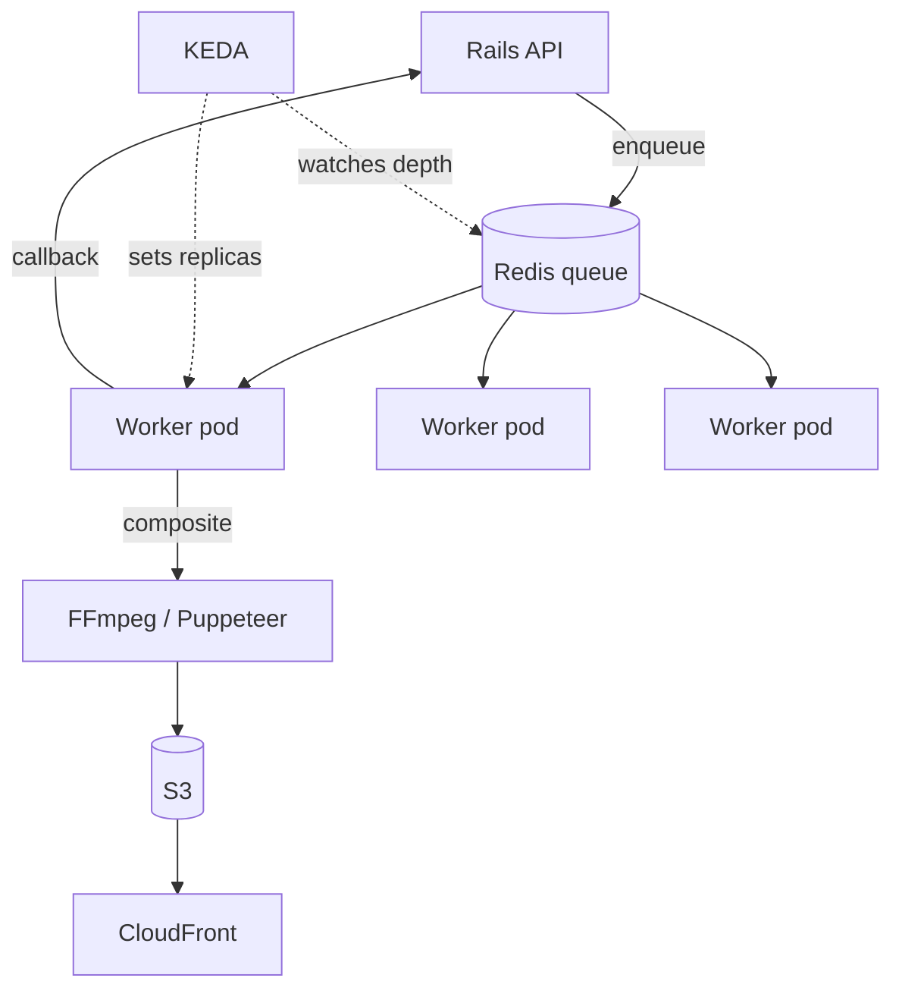

The product Praja actually charges for is a personalised poster: a user's photograph, cut out from its background, composited onto a designed template alongside political party imagery and text in their language, rendered as an image and as a short video. On a festival day, a lot of people want one at once.

This is the pipeline that makes them. It has been rebuilt roughly three times, and each rebuild was driven by a different bottleneck.

## Version one: Lambda and FFmpeg

The first design was serverless and it was a reasonable starting point. An S3 upload or an API call triggered a Lambda; the Lambda pulled assets, ran FFmpeg with a filter graph to composite the layers and produce a video, and wrote the result back to S3.

What was right about it: no idle cost, and the concurrency model was somebody else's problem.

What went wrong, in the order we hit it:

- **Timeouts on success.** The most maddening failure mode. Generation completed, the file was written, and the Lambda timed out before it finished reporting — so the system believed a successful generation had failed and retried it. Fixing this was a matter of getting the callback and the work into a correct order rather than a hopeful one.
- **Cold starts under burst.** Exactly the profile we have. A thousand requests arriving in a minute meant a thousand cold starts, each paying to load a large binary and its dependencies.
- **CDN egress cost.** The Lambdas were downloading source media over CloudFront URLs, which meant paying CDN egress to serve our own backend. Switching to direct S3 reads was a straightforward and significant saving.
- **Platform-specific rendering bugs.** An iOS black-frame issue that took two attempts to fix, because the first frame of a video encoded from a still image is genuinely ambiguous territory across players.
- **Cost at volume.** Per-invocation pricing for CPU-heavy work at festival scale compared badly with a pod that stays warm.

## Version two: in-cluster video processing

The rebuild moved generation into the Kubernetes cluster as a NestJS service — a dedicated video processing service, with a Redis-backed queue and workers that stay warm.

Two rendering paths, because posters and videos are different problems:

- **Images** are rendered with **Puppeteer** against HTML templates. This sounds heavy and is: a real browser laying out real HTML. It is also the only sane way to get correct multilingual text layout, because the alternative is reimplementing text shaping for several Indic scripts. Font loading was optimised heavily — it was the dominant cost per render until we fixed it.
- **Videos** stay with **FFmpeg** filter graphs, compositing the cutout and template layers over a base video.

This is where the multilingual detail lives, and it is more finicky than it appears. Tamil needed its own line-height handling, because a line height that looks correct in Telugu clips ascenders in Tamil. Name transliteration between scripts went through AWS Translate and later an LLM, because rule-based transliteration of proper nouns produces results that are technically defensible and obviously wrong to a native reader.

## Version three: scaling it correctly

Getting the workers in-cluster solved cold starts and cost. It created a new problem: how many workers?

**CPU-based autoscaling was the wrong signal**, and the reason is worth being precise about. A worker waiting on an FFmpeg subprocess or an S3 round trip is not burning CPU. So CPU utilisation understates the backlog: the queue is deep, the pods look relaxed, and the autoscaler sees no reason to act. You scale up well after you needed to, and scale down while work is still queued.

**KEDA scaling on Redis queue depth** measures the thing we care about. Queue length is the backlog, directly. Scale-up leads demand instead of trailing it.

The PR history here is a run of small adjustments on consecutive days — scaling metrics, minimum replicas, concurrency, memory targets — which is what tuning honestly looks like. Three things I'd carry to the next one:

**A wrong scaler key fails silently.** We shipped a KEDA configuration pointing at a Redis key that didn't match what the producer wrote. The scaler read an always-empty queue, held minimum replicas, and nothing looked broken until the backlog was hours deep. Now the first thing I verify on any queue-based scaler is that the key matches on both sides, in the same environment.

**Per-worker concurrency and replica count are one decision, not two.** Raising in-process concurrency and raising replicas both increase throughput, and they trade against each other for memory. Tuning them independently produced a period where we had plenty of capacity and kept running out of memory.

**Minimum replicas are a latency choice.** Interactive generation keeps a floor of warm workers. Bulk campaign generation is allowed to scale to zero and pay a cold start, because nobody is watching a progress bar.

## Reliability details that earned their place

**Fallback progress checks.** A generation can fail in ways that produce no error — a subprocess killed by the OOM killer reports nothing. A periodic worker checks for campaigns whose progress has stalled and re-drives them. The check interval was tuned from five to ten minutes after we found the shorter window was re-triggering work that was merely slow.

**Stale asset cleanup.** Generated video posters are large and most are never looked at twice. A cleanup worker plus S3 object expiry tags bounds the storage growth, with the expiry set at write time rather than swept later.

**Alerting on the pipeline specifically.** Generic error alerts don't tell you that generation is failing for one template or one language. The pipeline has its own error alerts.

**Explicit queue placement.** Generation queues moved to `low` for cron-driven bulk runs so they couldn't starve interactive work — the same lesson as everywhere else in this platform: queue choice is a reliability decision.

## Where it stands

Generation runs on warm in-cluster workers that scale on queue depth, images render through Puppeteer with correct multilingual layout, videos through FFmpeg, output lands in S3 behind CloudFront with lifecycle expiry, and the whole thing has its own alerting and a stall-recovery path.

The lesson I keep returning to is the autoscaling one. **An autoscaler is only as good as its correlation with the thing you actually care about.** CPU is a proxy for load in a request-serving service and nearly useless in a queue-draining one. Measuring the queue was worth more than every other optimisation in this pipeline combined.
