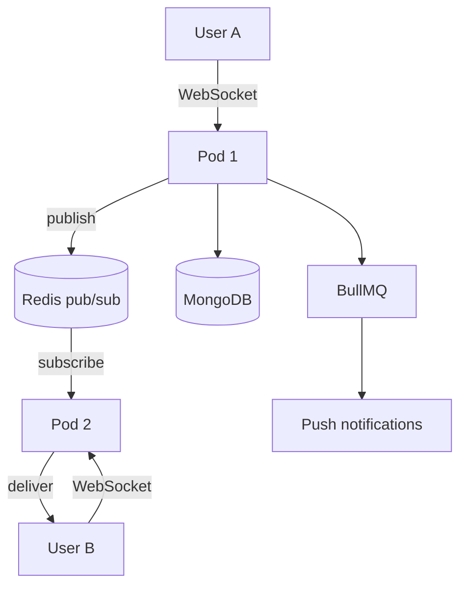

Direct messages, group chats and broadcast channels for the Praja app. I owned this service from early on — around 340 pull requests and 380 commits over three years — which means I also own its mistakes.

## The shape of it

A WebSocket server can't be a single process, and the moment it isn't, you have a distributed systems problem: two users in one conversation may be connected to two different pods.

The standard solution, and the one we used: **Redis pub/sub as the fan-out layer.** A pod that receives a message publishes it to a channel; every pod subscribed to that channel delivers to whichever of its own sockets care. Pods stay stateless with respect to each other and scale horizontally.

Around that:

- **MongoDB** for message persistence. Messages are documents with a flexible shape — text, attachments, post previews, system events — and they are written far more than they are queried in aggregate. A document store was the right call and I'd make it again.
- **BullMQ** for deferred work: push notification dispatch, throttled jobs, anything that shouldn't block the socket handler.
- **JWT** for socket authentication, with a conversation-token fallback for cases where the primary path failed.
- **ULIDs** for message IDs, replacing UUIDs. This one is worth explaining.

## Why ULIDs instead of UUIDs

Message IDs are generated client-side so the sender can render a message optimistically before the server confirms it. That means the ID has to be unique without coordination.

UUIDv4 does that but is random, so a chronologically ordered stream of messages produces IDs with no ordering relationship. Every insert lands in a random spot in the index. ULIDs are lexicographically sortable by generation time, so message IDs sort in roughly the order the messages were created — insertion is append-like, and "fetch the next page of this conversation" becomes a range scan.

The migration also surfaced a real bug: duplicate message IDs, which had to be handled explicitly on the client rather than assumed away.

## Adding NATS, then removing it

The change I learned the most from.

We introduced NATS with stream configuration, added horizontal load balancing for request-reply subscriptions, and ran it in production for about three months. Then we removed it.

The reasoning going in was sound on paper: Redis pub/sub is fire-and-forget, so a pod that is briefly unreachable misses messages entirely. NATS with streams gives durability and replay.

The reasoning coming out was more grounded:

- **We were not using the durability.** Messages were already persisted in MongoDB before fan-out. The delivery guarantee we actually needed — "the recipient eventually sees this" — was satisfied by persistence plus the client fetching on reconnect, not by broker durability.
- **It was a second stateful system** to configure, monitor, back up and reason about, in exchange for a property we were getting elsewhere.
- **The failure modes got worse, not better.** Stream configuration became a thing that could be wrong, in a subtle way, at 3am.

The removal is a single PR titled "removing nats". The revert-then-re-revert sequence around the stream configuration is also in the history, which is a fair record of how confident we were at the time.

What I take from it: **durability in the transport is not the same as durability in the system.** If the data is already safe, a durable broker is buying you ordering and replay convenience, and you should be honest about whether you need those specifically.

## Presence, which is harder than it sounds

Online status tracking has its own module, and the reason is that "is this user online" has no clean answer.

A socket that is open is not proof the user is present — phones sleep, networks lie, and a TCP connection can stay nominally open long after the app was backgrounded. A socket that has closed is not proof of absence either, because a reconnect may be seconds away.

What you end up with is heuristics with timeouts, held in Redis with TTLs, and an acceptance that the status is an estimate. Blocking made this worse: when one user blocks another, both need a disconnect event emitted for the pair, which means presence state and moderation state are coupled in a way neither was designed for.

## Multi-tenancy of a different kind: language

The platform is regional and multilingual, which reached into the messaging service in a way I didn't anticipate.

Notification text has to be in the *recipient's* language, not the sender's or the server's. That sounds obvious stated plainly, and it was not obvious in the code, where locale had quietly become a property of the request rather than of the person being notified. Fixing it meant threading locale through JWT claims so the notification builder had access to the right one at the right moment.

## Operational work

- **Moved off a managed Redis onto a self-hosted deployment** in-cluster, then onto a dedicated database index, for cost and isolation.
- **Log discipline.** A meaningful fraction of my PRs to this service demote logs from `warn` to `debug` or delete them. On a service handling every message on the platform, an over-eager log line is a cost centre and an obstacle to seeing real errors.
- **Load testing** with k6 against staging, which is how the horizontal scaling claims got tested rather than asserted.
- **New Relic instrumentation** with custom utilities, because default APM instrumentation understands HTTP requests and does not understand a socket event.

## What I'd do differently

I'd design presence as explicitly approximate from day one, with the TTLs and the semantics written down, instead of discovering the ambiguity through bug reports.

And I'd apply a harder test before adding infrastructure: *what specific property am I buying, and which existing component currently provides it?* The NATS experiment would not have survived that question, and it would have saved three months.
